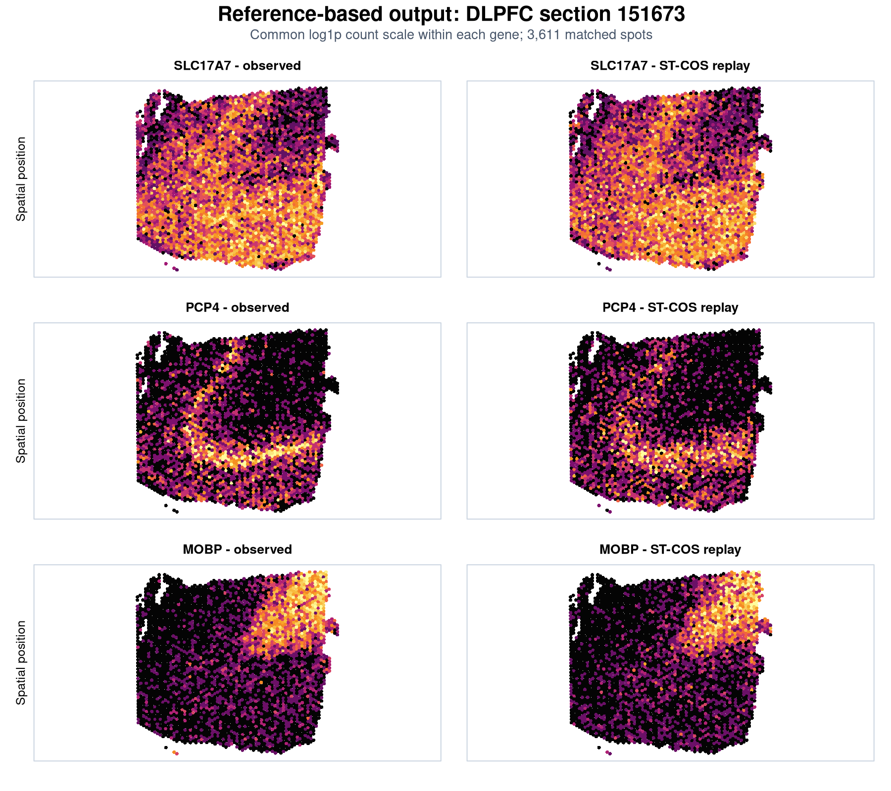

Reference-based mode estimates simulation parameters from an observed spatial
transcriptomics dataset. The current release treats the reference as one
global spot-level profile (`CT`) and does not infer separate cell-type-specific
dependence matrices.

The worked output below uses human dorsolateral prefrontal cortex (DLPFC)
section 151673. The reference and simulation contain the same 3,611 annotated
spots; ST-COS estimates the negative-binomial marginals, spatial mean fields,
and global latent dependence structure from the observed section before
generating a new realization.

## 1. Prepare the inputs

`expr` must contain genes in rows and spots in columns. `spatial_coord` must
contain the same spots in the same order, with columns named `row` and `col`.

```{r input-checks, eval=FALSE}
stopifnot(
  is.matrix(expr),
  ncol(expr) == nrow(spatial_coord),
  all(c("row", "col") %in% colnames(spatial_coord)),
  all(is.finite(expr)),
  all(expr >= 0)
)

gene_names <- rownames(expr)
spot_names <- colnames(expr)
rownames(spatial_coord) <- spot_names
```

Use raw non-negative counts. Do not supply log-normalized expression to the
negative-binomial fitting step.

## 2. Estimate reference parameters

```{r fit-reference, eval=FALSE}
library(STCOS)

fitted <- get_real_param(
  expr = expr,
  coord = spatial_coord,
  gene_names = rownames(expr),
  moran_thr = 0.15,
  cor_thr = 0.05,
  block_size = 1024,
  n_cores = 4,
  eigen_floor = 1e-6,
  neighbor_k = 6,
  spline_k = 50,
  dispersion_cap = 1e6
)

names(fitted)
# mean_param, theta_g, gene_relationship, cov_gene,
# matrix_diagnostics
```

The fitted objects can be inspected before simulation:

```{r inspect-fit, eval=FALSE}
dim(fitted$mean_param$CT)       # spots x genes
length(fitted$theta_g$CT)      # one NB size per gene
dim(fitted$cov_gene[, , "CT"]) # genes x genes
fitted$matrix_diagnostics
```

Matrix-repair diagnostics include the minimum eigenvalues before and after
repair, minimum lift, number of modified eigenvalues, relative Frobenius
perturbation, and maximum entry-wise change.

## 3. Generate a fitted replay

```{r generate-replay, eval=FALSE}
set.seed(11)

replay <- generate_true_count(
  coord = spatial_coord,
  mean_param = fitted$mean_param,
  gene_relationship = fitted$gene_relationship,
  cov_gene = fitted$cov_gene,
  theta_g = fitted$theta_g,
  eigen_floor = 1e-6
)

simulated_counts <- replay$CT # spots x genes
```

This output is a newly generated realization from the fitted marginal,
spatial, and latent dependence parameters. It is not a resampled copy of the
observed count matrix.

### Example output: DLPFC section 151673

The panels use a common color range within each gene and compare the observed
section with one fitted ST-COS replay. SLC17A7 and PCP4 show cortical
expression patterns, while MOBP marks white matter.



The plotted output was generated from the same matched spot identifiers used
for model fitting. A complete analysis can use the full retained gene panel;
the three genes shown here keep the tutorial output readable.

## 4. Create a spatial counterfactual

Because fitted parameters are explicit, a selected spatial mean can be edited
while the other fitted parameters remain fixed. The example below increases
one gene within a user-defined band.

```{r spatial-intervention, eval=FALSE}
target_gene <- "MOBP"
band <- spatial_coord$row >= 4 & spatial_coord$row <= 5

edited_mean <- fitted$mean_param
edited_mean$CT[band, target_gene] <-
  8 * edited_mean$CT[band, target_gene]

set.seed(11)
spatial_counterfactual <- generate_true_count(
  coord = spatial_coord,
  mean_param = edited_mean,
  gene_relationship = fitted$gene_relationship,
  cov_gene = fitted$cov_gene,
  theta_g = fitted$theta_g
)$CT
```

Use anatomical labels or a prespecified coordinate mask in place of the
illustrative row-based band when working with real tissue.

## 5. Rewire a selected dependence block

The next example changes only one latent correlation block. The matrix is
repaired automatically if needed before Cholesky factorization.

```{r dependence-intervention, eval=FALSE}
target_genes <- c("MOBP", "CNP", "MAG")
target_genes <- intersect(
  target_genes,
  dimnames(fitted$cov_gene)[[1]]
)

edited_dependence <- fitted$cov_gene
edited_dependence[target_genes, target_genes, "CT"] <- 0.6
diag(edited_dependence[, , "CT"]) <- 1

set.seed(11)
dependence_counterfactual <- generate_true_count(
  coord = spatial_coord,
  mean_param = fitted$mean_param,
  gene_relationship = fitted$gene_relationship,
  cov_gene = edited_dependence,
  theta_g = fitted$theta_g
)$CT
```

Evaluate the intervention on both Pearson and Spearman scales, and verify that
unedited gene means, dispersions, and dependence edges remain close to the
paired replay baseline.

## 6. Practical guidance

- Keep `eigen_floor = 1e-6` unless factorization fails; it is a numerical floor,
  not a parameter that normally requires tuning.
- Treat `cor_thr` as a modeling choice because it changes dependence-matrix
  sparsity and fidelity.
- Use `neighbor_k = 6` for settings comparable to the Visium analyses in the
  study, and examine other values for different spatial resolutions.
- Increase `block_size` or `n_cores` only after confirming memory availability.
- Dense dependence estimation requires quadratic memory and Cholesky
  factorization requires cubic time in the number of genes.

<div class="warning">
A global correlation matrix estimated from heterogeneous spots can contain
composition-driven association. Do not interpret it automatically as
within-cell-type co-regulation.
</div>
