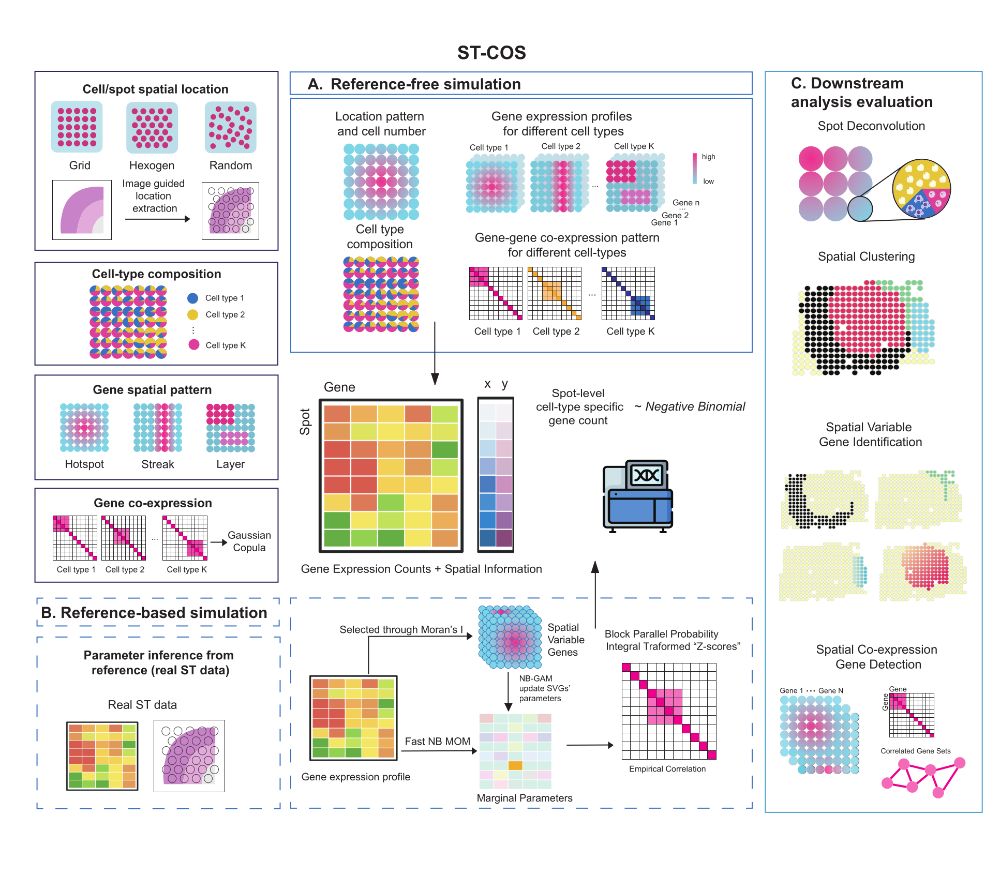

ST-COS simulates spatial transcriptomics data with configurable spatial gene
patterns, cell-type composition, negative-binomial marginals, and explicit
latent gene-gene dependence.

## Choose a workflow

| Goal | Start here |
| --- | --- |
| Design cell types, spatial patterns, and gene modules from scratch | [Reference-free tutorial](Example.html) |
| Fit a model to an observed spatial transcriptomics dataset | [Reference-based tutorial](Data_code.html) |
| Upload a histology image or coordinate file and design a simulation interactively | [Image-guided Shiny app](https://yiyanz.shinyapps.io/st-cos/) |
| Install the package and check input dimensions | [Installation and inputs](Rpackage.html) |

## What ST-COS controls

ST-COS separates five parts of a simulation:

1. Spatial coordinates and cell-type abundance fields.
2. Cell-type-specific spatial mean expression.
3. Gene-specific negative-binomial marginals.
4. Latent Gaussian pairwise dependence among selected genes.
5. Abundance-weighted construction of spot-level profiles.

This separation lets users change one component while holding the others
fixed, which is useful for controlled benchmark scenarios and counterfactual
experiments.

The specified correlation matrix is a latent Gaussian target. Pearson and
Spearman correlations measured from the final counts can be smaller because
of discretization, sparsity, and spot-level mixing.

## Package and source

- [ST-COS package](https://github.com/Yiyannnnn/ST-COS)
- [Image-guided Shiny app](https://yiyanz.shinyapps.io/st-cos/)
- [Tutorial source](https://github.com/Yiyannnnn/STCOS_tutorial)
- [Issue tracker](https://github.com/Yiyannnnn/ST-COS/issues)
